# pet-with-you

**让一只小伙伴，陪你工作，也陪你发呆。**

一个运行在 Windows 桌面上的动画桌宠：可以随机玩耍、手动点播、聊天与碎碎念，也可以连接 Codex 桌面客户端，展示任务进度和账户额度。

> `0.1.0-alpha.7.1.6` Windows 公开预览版：[下载安装程序](https://github.com/Refining-colors/pet-with-you/releases/tag/v0.1.0-alpha.7.1.6)。纯桌宠无需另装 Node.js、Git 或 Codex CLI。由 [Refining-colors](https://github.com/Refining-colors) 维护。项目代码采用 MIT，角色动画按原作条款说明。

基于 [PC2005-cloud/dsh-pet](https://github.com/PC2005-cloud/dsh-pet) 改造与扩展，保留原作角色和 106 段动画。原作代码、素材与本项目适配工作的关系见 [来源与致谢](ATTRIBUTION.md)。

[快速开始](#快速开始) · [功能介绍](#功能介绍) · [动画图鉴](#动画图鉴) · [模式与连接](#模式与连接) · [常见问题](#常见问题) · [全流程配置](docs/INSTALL.md) · [使用手册](docs/USER_GUIDE.md) · [排错](docs/TROUBLESHOOTING.md)

## 看看它能做什么


| 聊天与碎碎念 | 密钥 / 代理统计 | 登录账户额度 |
| --- | --- | --- |
|  | 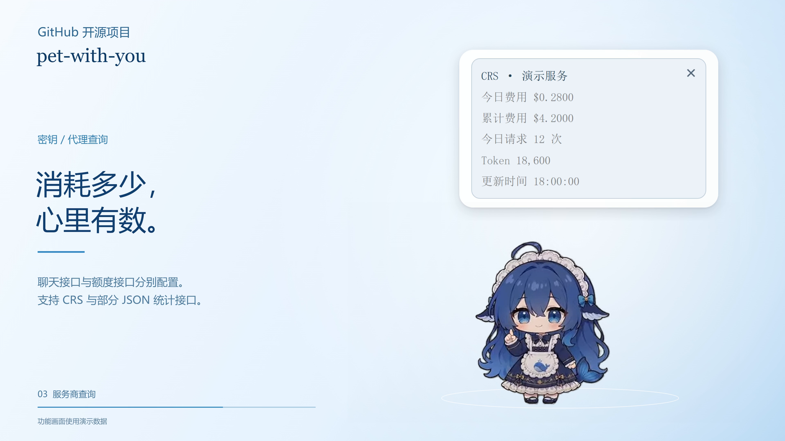 |  |

多任务进度、聊天回复和不同来源的额度，都能在桌宠旁边查看。配图中的任务、回复和额度均为演示数据。

## 功能介绍

### 全部动作，先看一眼

| 吃什么 | 玩耍 | 季节 | 互动 |
| --- | --- | --- | --- |
|  |  |  |  |

[向下查看完整动画图鉴 →](#动画图鉴)，也可打开[独立图鉴](docs/ANIMATIONS.md)查看逐项名称与表情图说明。

### 陪伴与互动

- **106 段动画**：待机、点击回应、吃东西、玩耍等；日常动作按分类权重随机轮换，也可右键手动点播。
- **桌面互动**：拖动、抛掷、尺寸调整、多宠物同屏，支持禁止自主跑动。
- **窗口与位置**：四种互斥窗口模式：普通显示、始终置顶、全屏隐藏、在GPT置顶，其余全屏隐藏；支持靠近屏幕底部、任务栏上方及客户端窗口下沿时吸附。
- **位置记忆**：切换模式、重新打开时尽量恢复原位置；显示器变化时将宠物调整到可见区域。
- **托盘管理**：单击托盘图标立即显示并临时置顶 8 秒；隐藏托盘图标后，可以从桌宠右键菜单恢复。

### 聊天与碎碎念

- 使用自己的 OpenAI 兼容 API，填写地址、模型和密钥即可配置聊天服务。
- 支持手动碎碎念、自动碎碎念，以及间隔和触发概率设置。
- 碎碎念支持流式显示，本次运行内记录历史并拦截完全重复的句子。
- 回复可选中文字复制，右上角关闭；停留方式支持定时、下一次信息前保留、永久保留。
- 支持系统字体和导入字体；查询字体与基础反馈／聊天字体分别设置。
- 当前 API 配置与命名配置列表分开管理，支持保存、载入、删除和清除。

### Codex 任务联动

- 展示思考、执行工具、整理结果、等待确认、出错和回合完成等已观测到的状态。
- 基础动画反馈与原生风格任务卡可分别开关；同时启用时任务卡显示在上方。
- 多任务按优先级展示，最多列出三个任务，更多任务显示数量；已识别的对话标题可点击打开。
- 提供“关闭事件响应”开关，演示或录屏时暂停任务动画、任务气泡、任务通知和回合结束自动额度查询。
- 首次连接询问是否创建 **Codex withu** 联动启动器，可自选目录，双击同时打开客户端与桌宠；无需常驻启动检测。随客户端关闭和开机自启动仍分别设置。

### 额度与设置

- Codex 登录额度展示 **5 小时和 1 周的已用／剩余比例、各自重置时间、可用重置次数和更新时间**。
- 支持 CRS 统计查询和部分服务商的通用 JSON 余额接口。
- 支持回合结束后自动查询，默认关闭；有其他任务时暂缓显示最新查询结果。启动、闲置和设置重建不会自行查询弹出额度。
- 设置分为“基础设置”和“GPT连接设置”，同一选项卡内的模块可以拖动排序。
- 普通设置修改后，关闭设置窗口自动保存；失败时保留窗口和未保存的内容。
- 所有普通设置集中于 `settings.json`，设置底部可定位并分享；实际密钥单独在本机加密保存。
- 基础设置底部可选择目录创建名为 `pet-with-u`、带角色图标的启动快捷方式，同名文件自动另加编号。
- 首次正常启动时会询问是否创建快捷方式，可选择保存目录或跳过；选择会被记住，后台联动启动不弹出此提示。
- 提供错误日志、导出反馈、打开日志目录及清除日志功能。

## 快速开始

### 推荐：下载安装版

1. 打开 [Releases 下载页](https://github.com/Refining-colors/pet-with-you/releases/tag/v0.1.0-alpha.7.1.6)，下载 **pet-with-you-0.1.0-alpha.7.1.6-x64-setup.exe**。
2. 双击安装，选择目录和是否创建桌面快捷方式。
3. 从桌面或开始菜单中的 **pet-with-u** 启动，默认纯桌宠；右键打开设置。

安装版自带运行环境，不需要下载源码。`Source code (zip)` 是开发者使用的源码压缩包。当前安装包未签名，可能出现未知发布者提示；下载页附 SHA-256 校验值。升级前退出桌宠，安装新版后保留原设置。详见 [完整安装手册](docs/INSTALL.md)。

### 运行环境

- Windows 10 / 11。
- 安装程序自带运行环境，纯桌宠无需额外安装 Node.js。
- 源码启动需要 Node.js 22.12 或更高版本，首次安装需要下载 Electron 依赖。

安装程序会询问安装目录和是否创建桌面快捷方式。构建与验证见 [打包说明](docs/PACKAGING.md)。纯桌宠可以独立运行，不需要 Codex、Git 或密钥。初次接触 GitHub 请从 [零基础配置手册](docs/INSTALL.md) 开始。

### 从源码安装和启动

1. 安装 [Node.js LTS](https://nodejs.org/en/download)（至少 22.12，保留 npm 和 PATH 选项）。
2. 在本仓库点击 **Code → Download ZIP**，完整解压到准备长期保留的目录。
3. 双击 `Install-Pet.cmd` 安装依赖，等待提示完成。可双击 `Check-Setup.cmd` 检查环境。
4. 双击 `Start-Pet.cmd` 启动桌宠；右键打开设置。
5. 首次默认使用纯桌宠模式；右键宠物可查看动作和打开设置。

安装脚本负责下载项目依赖与 Electron，不会自动安装 Node.js、Git 或 Codex。首次下载可能需要几分钟；失败可按 [下载排错](docs/TROUBLESHOOTING.md#安装下载失败) 重试。

也可在项目目录使用终端：

```powershell
npm ci --include=dev
node launch.cjs
```

### 三个启动入口

| 文件 | 作用 |
| --- | --- |
| `Start-Pet.cmd` | 只启动桌宠，使用上次保存的模式；右键打开设置 |
| `Connect-Pet.cmd` | 打开连接设置，适合先配置客户端联动 |
| `Start-And-Connect.cmd` | 启动桌宠并准备客户端联动配置 |

`Install-Pet.cmd` 会询问是否创建桌面快捷方式，也可单独运行 `Create-Shortcut.cmd`；快捷方式使用与托盘相同的角色图标。移动源码目录后请重新创建。更详细的说明见 [安装与启动](docs/INSTALL.md)。

## 模式与连接

| 能力 | 纯桌宠 | 连接 Codex 桌面客户端 |
| --- | --- | --- |
| 日常动画、随机播放、手动点播 | 支持 | 支持 |
| 自有 API 聊天与碎碎念 | 支持 | 支持，可选择服务来源 |
| 服务商密钥／代理额度查询 | 配置接口后支持 | 配置接口后支持 |
| 客户端任务状态反馈 | 关闭 | 根据本机可用事件显示 |
| Codex 登录账户额度 | 关闭 | 账户和接口可用时支持 |
| 联动启动器／随客户端关闭 | 已创建的启动器可同时打开两个应用，保留纯桌宠模式；不随客户端退出 | 可创建启动器，随关闭单独设置 |

### 使用自己的 API

在“基础设置 → 聊天与碎碎念”填写 API 地址、模型和密钥。支持 OpenAI 兼容 Chat Completions；地址可以是服务商的 `v1` 根地址或完整的 `chat/completions` 地址。模型名需要由服务商支持。

关闭设置即可应用当前配置。“保存到配置列表”用于留存可重复载入的命名配置；清除当前配置不会删除列表中的副本。

### 连接 Codex

开启“连接 GPT 客户端”后，会出现“GPT连接设置”选项卡。首次连接可选择桌宠聊天使用当前账户／config 配置，或使用自有 API。

桌宠优先查找桌面客户端附带的兼容 `codex.exe`。若安装渠道没有提供，需要自行选择已有兼容运行程序，或安装 Codex CLI。纯桌宠及自有 API 聊天无需此运行程序。

任务反馈通过本机任务记录与 Hooks 配合获取；Hooks 首次使用可能需要在 `/hooks` 中审阅并信任。设置中显示真实事件，才能确认已观测到客户端任务。

目前任务联动针对 **Codex 桌面客户端**。界面中的“GPT连接设置”是功能分组名称，兼容性以实际支持的客户端与事件为准。本地任务记录格式可能随客户端版本改变，远程或云端任务也可能无法完整显示。

## 用量与数据

| 操作 | 是否调用聊天模型 |
| --- | --- |
| 播放动画、拖动、设置、任务状态反馈 | 否 |
| 查询额度或服务商统计 | 否，查询对应额度接口 |
| 手动聊天、手动碎碎念 | 是 |
| 自动碎碎念命中概率并实际生成 | 是 |

- 配置和运行数据位于当前 Windows 用户的 `%APPDATA%\DSH Pet Companion`。这是保留的兼容目录名，升级改名不会丢失设置，具体用户名/磁盘路径不写死。
- 自有 API 密钥和手动查询密钥通过系统加密保存；界面显示掩码。
- 聊天内容会发送给你选择的服务，聊天记忆可保存在本机；碎碎念历史只保留在本次桌宠运行内。
- 当前项目的错误日志不记录密钥、聊天正文或服务商完整响应。
- 对外分享项目时，只分享整理后的源码和授权素材；个人配置、登录文件、密钥及私人字体属于本机数据。

## 常见问题

<details>
<summary>为什么打开了连接开关，任务卡还没有变化？</summary>

开关用于启用连接功能，任务卡需要真实的任务事件。检查设置中的连接状态、任务联动勾选和“关闭事件响应”开关；继续或新开一个任务以观察事件。Hooks 是否受信任与本地会话读取状态可分别检查。

</details>

<details>
<summary>多个任务一起运行，桌宠会显示哪一个？</summary>

基础动画一次表达一种状态。优先级从高到低为：等待确认、工具出错、执行工具、思考、整理结果、回合完成；同级优先显示最近更新的任务。任务卡同时列出最多三个任务。数量只涵盖已观测到的任务。

</details>

<details>
<summary>聊天能用，为什么余额查不到？</summary>

聊天 API 与余额接口是不同的服务。余额查询需要服务商提供的查询接口及正确的凭据来源。当前支持 CRS 和部分 HTTPS JSON 查询接口；并非所有服务商都提供余额查询。

</details>

<details>
<summary>周额度或可用重置次数显示“未提供”是什么意思？</summary>

表示本次接口没有返回该项，不能按零用量或零次数理解。更新时间为最近成功取得数据的本机时间，缓存期间保持不变。

</details>

<details>
<summary>每次修改都要点击保存吗？</summary>

普通设置在关闭设置窗口时自动保存。保存到命名配置列表、载入、删除和清除是独立操作，仍使用对应按钮。输入无效或保存失败时窗口会保留并显示提示。

</details>

<details>
<summary>移动了项目目录，开机启动或联动失效了怎么办？</summary>

在新目录手动启动一次，更新启动入口，并重新连接以刷新 Hooks 路径；必要时重新信任 Hooks。删除项目前先关闭相关自启动开关。用户数据与源码目录分开保存。

</details>

<!-- ANIMATION_GALLERY:START -->
## 动画图鉴

**106 段动画**按分类展示。将鼠标放在预览上可查看名称，点击可打开原始动画；所有动作均可在桌宠右键菜单中点播。

日常随机播放与事件触发使用不同的动作池，额度、任务等专用动画不会混入普通随机播放。

### 待机与转向（2）

随机动作链中的待机与转向，也可手动点播。

<p>
<a href="assets/webm/%E5%BE%85%E6%9C%BA%E5%91%BC%E5%90%B8%E4%BC%91%E9%97%B2.webm"></a>
<a href="assets/webm/%E4%B8%9C%E5%BC%A0%E8%A5%BF%E6%9C%9B.webm"></a>
</p>

### 小动作（18）

日常随机分类，权重 20；右键 → 动作 → 小动作 可逐个点播。

<p>
<a href="assets/webm/%E6%82%A0%E9%97%B2%E5%93%BC%E6%AD%8C.webm"></a>
<a href="assets/webm/%E8%B6%85%E5%A4%A7%E4%BC%B8%E6%87%92%E8%85%B0.webm"></a>
<a href="assets/webm/%E5%8E%9F%E5%9C%B0%E6%95%B2%E5%87%BB%E6%A1%8C%E9%9D%A2%E4%BA%92%E5%8A%A8.webm"></a>
<a href="assets/webm/%E5%8E%9F%E5%9C%B0%E9%87%8D%E5%8A%9B%E4%B8%8B%E8%B9%B2%E5%8E%8B%E7%BC%A9.webm"></a>
<a href="assets/webm/%E5%93%88%E6%AC%A0%E8%BF%9E%E5%A4%A9.webm"></a>
<a href="assets/webm/%E5%8E%9F%E5%9C%B0%E5%B0%8F%E6%86%A9%E6%B2%89%E7%9C%A0.webm"></a>
<a href="assets/webm/%E5%A5%B3%E4%BB%86%E5%B1%88%E8%86%9D%E7%A4%BC%E4%BB%AA.webm"></a>
<a href="assets/webm/%E8%A2%AB%E5%90%93%E4%B8%80%E8%B7%B3.webm"></a>
<a href="assets/webm/%E5%B0%8F%E5%B9%85%E5%BA%A6%E5%8E%9F%E5%9C%B0360%E5%BA%A6%E6%97%8B%E8%BD%AC%E5%B1%95%E7%A4%BA.webm"></a>
<a href="assets/webm/%E5%81%B7%E5%90%83%E9%9B%B6%E9%A3%9F%E8%A2%AB%E6%8A%93%E4%BD%8F.webm"></a>
<a href="assets/webm/%E7%94%A8%E9%B2%B8%E9%B1%BC%E5%B0%BE%E5%B7%B4%E6%8B%8D%E6%89%93%E5%9C%B0%E9%9D%A2.webm"></a>
<a href="assets/webm/%E6%89%93%E7%9E%8C%E7%9D%A1%E8%A2%AB%E6%83%8A%E9%86%92.webm"></a>
<a href="assets/webm/%E7%85%A7%E9%95%9C%E5%AD%90.webm"></a>
<a href="assets/webm/%E6%95%B4%E4%BD%93%E6%8D%A2%E8%A3%85%E8%AF%95%E8%89%B2.webm"></a>
<a href="assets/webm/%E8%BD%BB%E5%BF%AB%E8%AE%B0%E5%BD%95.webm"></a>
<a href="assets/webm/%E5%86%99%E4%BB%A3%E7%A0%81.webm"></a>
<a href="assets/webm/%E6%91%87%E6%89%87%E7%BA%B3%E5%87%89.webm"></a>
<a href="assets/webm/%E6%99%A8%E9%97%B4%E5%88%B7%E7%89%99.webm"></a>
</p>

### 玩耍（27）

日常随机分类，权重 20；右键 → 动作 → 玩耍 可逐个点播。

<p>
<a href="assets/webm/%E5%8E%9F%E5%9C%B0%E4%B8%93%E5%BF%83%E7%8E%A9%E9%AD%94%E6%96%B9.webm"></a>
<a href="assets/webm/%E5%8E%9F%E5%9C%B0%E8%B9%B2%E4%B8%8B%E7%8E%A9%E7%8E%A9%E5%85%B7%E6%B1%BD%E8%BD%A6.webm"></a>
<a href="assets/webm/%E9%B2%B8%E9%B1%BC%E5%90%90%E6%B3%A1%E6%B3%A1%E7%89%B9%E6%95%88.webm"></a>
<a href="assets/webm/%E5%8E%9F%E5%9C%B0%E8%B7%B3%E8%B7%83%E6%8A%93%E7%A2%8E%E5%A4%B4%E9%A1%B6%E7%89%A9%E5%93%81.webm"></a>
<a href="assets/webm/%E7%8E%A9%E6%B8%B8%E6%88%8F%E6%B0%94%E6%80%A5%E8%B4%A5%E5%9D%8F.webm">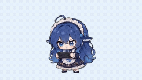</a>
<a href="assets/webm/%E7%8E%A9%E6%B0%B4%E6%9E%AA.webm"></a>
<a href="assets/webm/%E5%B0%8F%E6%8F%90%E7%90%B4%E6%BC%94%E5%A5%8F.webm"></a>
<a href="assets/webm/%E8%93%9D%E9%B2%B8%E7%8E%B0%E4%B8%96.webm">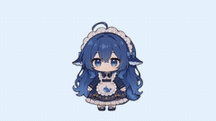</a>
<a href="assets/webm/%E4%BC%98%E9%9B%85%E5%A5%B3%E4%BB%86%E8%88%9E.webm"></a>
<a href="assets/webm/%E8%BD%BB%E5%BF%AB%E6%91%87%E6%91%86%E8%88%9E.webm"></a>
<a href="assets/webm/%E5%8F%AF%E7%88%B1%E5%AE%85%E8%88%9E.webm"></a>
<a href="assets/webm/%E5%90%B9%E6%B0%94%E7%90%83.webm"></a>
<a href="assets/webm/%E5%8A%A8%E7%89%A9%E7%8E%AF%E7%BB%95.webm"></a>
<a href="assets/webm/%E6%94%BE%E9%A3%8E%E7%AD%9D.webm"></a>
<a href="assets/webm/%E6%8B%86%E7%A4%BC%E7%89%A9.webm"></a>
<a href="assets/webm/%E5%8F%98%E9%B8%BD%E5%AD%90.webm"></a>
<a href="assets/webm/%E6%89%91%E5%85%8B%E9%AD%94%E6%9C%AF.webm"></a>
<a href="assets/webm/%E6%8A%BD%E9%99%80%E8%9E%BA.webm">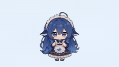</a>
<a href="assets/webm/%E5%90%B9%E7%AC%9B%E5%AD%90.webm"></a>
<a href="assets/webm/%E8%9D%B4%E8%9D%B6%E8%9C%9C%E8%9C%82%E7%8E%AF%E7%BB%95%E5%A4%B4%E9%A1%B6%E5%BC%80%E8%8A%B1.webm"></a>
<a href="assets/webm/%E6%92%B8%E7%8C%AB.webm"></a>
<a href="assets/webm/%E5%87%AD%E7%A9%BA%E7%94%9F%E8%8A%B1.webm">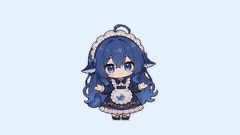</a>
<a href="assets/webm/%E9%AA%91%E6%9C%A8%E9%A9%AC.webm"></a>
<a href="assets/webm/%E4%B8%89%E7%90%83%E6%8A%9B%E6%8E%A5.webm">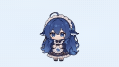</a>
<a href="assets/webm/%E8%B8%A2%E6%AF%BD%E5%AD%90.webm"></a>
<a href="assets/webm/%E4%B8%8B%E4%BA%94%E5%AD%90%E6%A3%8B.webm"></a>
<a href="assets/webm/%E8%8D%A1%E7%A7%8B%E5%8D%83.webm"></a>
</p>

### 吃什么（12）

日常随机分类，权重 16；右键 → 动作 → 吃什么 可逐个点播。

<p>
<a href="assets/webm/%E5%90%83%E7%99%BD%E9%A5%AD.webm"></a>
<a href="assets/webm/%E5%A4%A7%E5%8F%A3%E5%90%83%E9%9B%B6%E9%A3%9F.webm">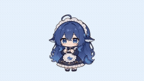</a>
<a href="assets/webm/%E5%90%83Token.webm"></a>
<a href="assets/webm/%E5%90%83%E6%97%A9%E9%A4%90.webm">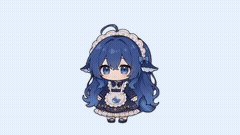</a>
<a href="assets/webm/%E5%90%83%E5%8D%88%E9%A4%90.webm"></a>
<a href="assets/webm/%E5%90%83%E6%99%9A%E9%A4%90.webm"></a>
<a href="assets/webm/%E5%90%83%E5%86%B0%E6%B7%87%E6%B7%8B%E8%9E%8D%E5%8C%96.webm"></a>
<a href="assets/webm/%E5%90%83%E5%A4%A7%E9%97%B8%E8%9F%B9.webm"></a>
<a href="assets/webm/%E5%90%83%E7%B3%96%E8%91%AB%E8%8A%A6.webm"></a>
<a href="assets/webm/%E5%90%83%E9%95%BF%E5%AF%BF%E9%9D%A2.webm"></a>
<a href="assets/webm/%E5%90%83%E8%A5%BF%E7%93%9C.webm"></a>
<a href="assets/webm/%E6%B6%AE%E7%81%AB%E9%94%85.webm">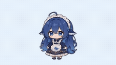</a>
</p>

### 时节（21）

日常随机分类，权重 14；右键 → 动作 → 时节 可逐个点播。

<p>
<a href="assets/webm/%E8%A2%AB%E8%90%BD%E5%8F%B6%E6%B7%B9%E6%B2%A1.webm">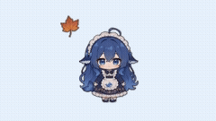</a>
<a href="assets/webm/%E4%B8%AD%E7%A7%8B%E8%B5%8F%E6%9C%88%E5%90%83%E6%9C%88%E9%A5%BC.webm"></a>
<a href="assets/webm/%E5%A0%86%E9%9B%AA%E4%BA%BA.webm"></a>
<a href="assets/webm/%E6%94%BE%E7%83%9F%E8%8A%B1.webm"></a>
<a href="assets/webm/%E5%90%83%E7%B2%BD%E5%AD%90.webm">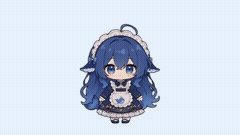</a>
<a href="assets/webm/%E5%90%83%E5%B9%B4%E7%B3%95.webm"></a>
<a href="assets/webm/%E5%90%83%E9%9D%92%E5%9B%A2.webm"></a>
<a href="assets/webm/%E5%90%83%E8%85%8A%E5%85%AB%E7%B2%A5.webm"></a>
<a href="assets/webm/%E5%90%83%E9%87%8D%E9%98%B3%E7%B3%95.webm"></a>
<a href="assets/webm/%E6%94%B6%E7%BA%A2%E5%8C%85.webm"></a>
<a href="assets/webm/%E5%86%99%E7%A6%8F%E5%AD%97.webm"></a>
<a href="assets/webm/%E7%A9%BF%E9%92%88%E4%B9%9E%E5%B7%A7.webm"></a>
<a href="assets/webm/%E8%88%9E%E7%8B%AE%E5%A4%B4.webm"></a>
<a href="assets/webm/%E8%AE%A8%E7%B3%96%E5%8D%97%E7%93%9C%E7%81%AF.webm">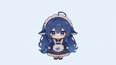</a>
<a href="assets/webm/%E6%8F%92%E8%8C%B1%E8%90%B8%E8%B5%8F%E8%8F%8A.webm">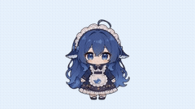</a>
<a href="assets/webm/%E6%94%BE%E6%B2%B3%E7%81%AF.webm"></a>
<a href="assets/webm/%E8%90%8C%E5%8C%96%E5%B0%8F%E5%B9%BD%E7%81%B5.webm">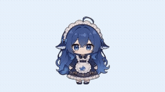</a>
<a href="assets/webm/%E8%A3%85%E7%82%B9%E5%9C%A3%E8%AF%9E%E6%A0%91.webm"></a>
<a href="assets/webm/%E6%94%BE%E5%AD%94%E6%98%8E%E7%81%AF.webm"></a>
<a href="assets/webm/%E5%90%83%E6%B1%A4%E5%9C%86.webm">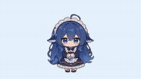</a>
<a href="assets/webm/%E5%90%83%E9%A5%BA%E5%AD%90.webm"></a>
</p>

### 文字（2）

日常随机分类，权重 10；右键 → 动作 → 文字 可逐个点播。含文字，镜像朝向时不参与随机播放。

<p>
<a href="assets/webm/%E6%98%AF%E5%95%8A%EF%BC%8C%E5%90%83%E4%BB%80%E4%B9%88.webm"></a>
<a href="assets/webm/%E6%B7%B1%E5%BA%A6%E6%80%9D%E8%80%83%E7%A2%8E%E7%A2%8E%E5%BF%B5.webm"></a>
</p>

### 点击回应（5）

点击宠物；右键动作菜单也能点播。候选轮换，避免连续重复。

<p>
<a href="assets/webm/%E7%82%B9%E5%87%BB%E5%9B%9E%E5%BA%94-%E5%BC%80%E5%BF%83%E8%B7%83%E5%8A%A8.webm"></a>
<a href="assets/webm/%E7%82%B9%E5%87%BB%E5%9B%9E%E5%BA%94-%E5%AE%B3%E7%BE%9E%E6%83%8A%E8%AE%B6.webm"></a>
<a href="assets/webm/%E7%82%B9%E5%87%BB%E5%9B%9E%E5%BA%94-%E5%82%B2%E5%A8%87%E7%94%9F%E6%B0%94.webm"></a>
<a href="assets/webm/%E7%82%B9%E5%87%BB%E5%9B%9E%E5%BA%94-%E6%8C%A0%E7%97%92%E5%92%AF%E5%92%AF%E7%AC%91.webm">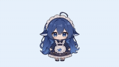</a>
<a href="assets/webm/%E7%82%B9%E5%87%BB%E5%9B%9E%E5%BA%94-%E5%85%83%E6%B0%94%E6%8C%A5%E6%89%8B.webm"></a>
</p>

### 拖拽（1）

按住宠物拖动；手动点播只演示姿态。

<p>
<a href="assets/webm/%E8%A2%AB%E9%BC%A0%E6%A0%87%E6%8B%96%E6%8B%BD%E6%82%AC%E7%A9%BA%E5%8F%8D%E9%A6%88.webm"></a>
</p>

### 移动与跑动（3）

随机移动或手动点播。「移动（原地播放）」只播姿态，「跑动（实际移动）」会改变桌面位置。禁止自主跑动不禁止手动跑动。

<p>
<a href="assets/webm/%E8%9E%83%E8%9F%B9%E8%B5%B0%E8%B7%AF.webm"></a>
<a href="assets/webm/%E5%8E%9F%E5%9C%B0%E6%BC%82%E6%B5%AE%E8%B8%8F%E6%AD%A5.webm"></a>
<a href="assets/webm/%E5%8E%9F%E5%9C%B0%E5%B7%A6%E8%BD%AC%E5%A5%94%E8%B7%91.webm"></a>
</p>

### 额度查询（6）

额度查询成功后按已用比例分档：0–20%、20–40%、40–60%、60–80%、80–不足100%、100%。不会因闲置自动查询；也可手动点播动画。

<p>
<a href="assets/webm/%E4%BD%99%E9%A2%9D-%E9%92%B1%E8%A2%8B%E6%BB%A1%E6%BA%A2.webm"></a>
<a href="assets/webm/%E4%BD%99%E9%A2%9D-%E9%87%91%E8%A2%8B%E5%8F%AE%E5%BD%93.webm"></a>
<a href="assets/webm/%E4%BD%99%E9%A2%9D-%E9%92%B1%E8%A2%8B%E5%A6%82%E5%B8%B8.webm"></a>
<a href="assets/webm/%E4%BD%99%E9%A2%9D-%E6%95%B0%E9%87%91%E7%9A%B1%E7%9C%89.webm"></a>
<a href="assets/webm/%E4%BD%99%E9%A2%9D-%E8%A2%8B%E7%A9%BA%E5%A6%82%E6%B4%97.webm"></a>
<a href="assets/webm/%E4%BD%99%E9%A2%9D-%E5%88%86%E6%96%87%E4%B8%8D%E5%89%A9.webm"></a>
</p>

### 碎碎念（3）

手动/自动碎碎念、聊天回复；仅生成文本会调用所选 API。手动点播动画不调用模型。

<p>
<a href="assets/webm/%E7%A2%8E%E7%A2%8E%E5%BF%B5-%E6%93%A6%E6%A1%8C%E7%A2%8E%E7%A2%8E%E5%BF%B5.webm"></a>
<a href="assets/webm/%E7%A2%8E%E7%A2%8E%E5%BF%B5-%E5%8F%91%E5%91%86%E7%A2%8E%E7%A2%8E%E5%BF%B5.webm"></a>
<a href="assets/webm/%E7%A2%8E%E7%A2%8E%E5%BF%B5-%E5%AF%B9%E5%B1%8F%E7%A2%8E%E7%A2%8E%E5%BF%B5.webm"></a>
</p>

### 任务反馈（6）

连接模式事件：思考、执行工具、整理结果、等待确认、完成、出错；事件关闭时不自动触发。可手动点播。

<p>
<a href="assets/webm/%E5%B7%A5%E4%BD%9C%E7%8A%B6%E6%80%81-%E6%80%9D%E8%80%83%E5%86%92%E6%B3%A1.webm">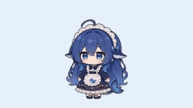</a>
<a href="assets/webm/%E5%B7%A5%E4%BD%9C%E7%8A%B6%E6%80%81-%E5%BF%99%E7%A2%8C%E7%82%B9%E6%8C%89.webm"></a>
<a href="assets/webm/%E5%B7%A5%E4%BD%9C%E7%8A%B6%E6%80%81-%E6%B8%85%E7%82%B9%E5%BD%92%E6%A1%A3.webm">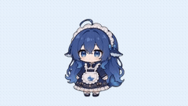</a>
<a href="assets/webm/%E5%B7%A5%E4%BD%9C%E7%8A%B6%E6%80%81-%E5%8E%9F%E5%9C%B0%E8%B8%B1%E6%AD%A5%E5%BC%A0%E6%9C%9B.webm"></a>
<a href="assets/webm/%E5%B7%A5%E4%BD%9C%E7%8A%B6%E6%80%81-%E9%9B%80%E8%B7%83%E5%BA%86%E7%A5%9D.webm"></a>
<a href="assets/webm/%E5%B7%A5%E4%BD%9C%E7%8A%B6%E6%80%81-%E5%9E%82%E5%A4%B4%E5%8F%B9%E6%B0%94%E5%86%92%E6%B1%97.webm"></a>
</p>

### 聊天与碎碎念表情图（27）

可按设置为聊天与碎碎念附图。以下为静态表情，完整使用语境见[独立图鉴](docs/ANIMATIONS.md#聊天与碎碎念表情图)。

<p>
<a href="assets/memes/%E5%90%83%E7%99%BD%E9%A5%AD%E7%9A%84%E5%A4%A7%E8%82%A5%E9%B1%BC.png"></a>
<a href="assets/memes/%E5%A4%A7%E7%9A%84%E8%A6%81%E6%9D%A5%E5%95%A6.png"></a>
<a href="assets/memes/%E5%A4%A7%E7%9A%84%E8%8D%AF%E6%9D%A5%E4%BA%86.png"></a>
<a href="assets/memes/%E8%A6%81%E4%B8%8D%E7%9B%B4%E6%8E%A5%E9%AA%82%E4%BB%96.png"></a>
<a href="assets/memes/%E6%AD%BB%E6%8E%89%E4%BA%86.png"></a>
<a href="assets/memes/%E6%B7%B1%E5%BA%A6%E7%9D%A1%E7%9C%A0.png"></a>
<a href="assets/memes/%E5%A4%A7%E7%83%A7%E8%B4%A7.png"></a>
<a href="assets/memes/%E5%85%88%E5%85%BB%E7%9D%80%E5%90%A7.png"></a>
<a href="assets/memes/%E5%90%83%E9%A5%B1%E9%A5%B1%E6%91%B8%E8%82%9A%E5%AD%90.png"></a>
<a href="assets/memes/%E8%AA%93%E6%AD%BB%E8%B7%B5%E8%A1%8C%E5%BC%80%E6%BA%90%E7%B2%BE%E7%A5%9E.png"></a>
<a href="assets/memes/%E7%94%B5%E6%AD%BB%E4%BD%A0.png"></a>
<a href="assets/memes/%E5%8F%AF%E7%88%B1.png"></a>
<a href="assets/memes/token%E7%BB%99%E5%A6%88%E5%A6%88%E4%BF%9D%E7%AE%A1.png"></a>
<a href="assets/memes/%E5%81%87%E5%A6%82%E7%BB%99%E6%88%91%E4%B8%89%E5%A4%A9%E5%A4%9A%E6%A8%A1%E6%80%81.png"></a>
<a href="assets/memes/%E5%8E%89%E5%AE%B3%E4%BA%86%E6%88%91%E7%9A%84%E9%B2%B8.png"></a>
<a href="assets/memes/%E5%93%A6%E9%B2%B8%E9%B2%B8.png"></a>
<a href="assets/memes/%E5%8E%8B%E5%8A%9B%E4%B8%80%E5%8F%AA%E5%A4%A7%E8%82%A5%E9%B1%BC.png"></a>
<a href="assets/memes/%E9%BB%8E%E6%9B%BC%E7%8C%9C%E6%83%B3%E6%B2%A1%E8%AF%81%E6%98%8E%E5%96%B5.png"></a>
<a href="assets/memes/%E9%99%A4%E4%BA%86%E8%B0%83%E6%83%85%E6%B2%A1%E5%95%A5%E7%94%A8.png"></a>
<a href="assets/memes/%E6%88%91%E4%B8%8D%E6%9B%B4%E6%96%B0%E4%BD%A0%E4%BB%AC%E7%94%A8%E4%BB%80%E4%B9%88.png"></a>
<a href="assets/memes/%E5%93%AA%E6%9D%A5%E7%9A%84%E7%94%B5%E8%84%91%E7%97%85%E6%AF%92.png"></a>
<a href="assets/memes/%E9%B1%BC%E7%89%87%E6%9C%89%E8%B5%84%E6%BA%90%E5%90%97.png"></a>
<a href="assets/memes/%E5%A4%A7%E5%B8%88%E8%BF%99%E4%B8%AA%E5%8C%BA%E6%98%AF%E4%BB%80%E4%B9%88%E6%84%8F%E6%80%9D.png"></a>
<a href="assets/memes/%E5%B0%B1%E9%AA%9A%E4%BA%86%E6%80%8E%E4%B9%88%E6%BB%B4%E5%90%A7.png"></a>
<a href="assets/memes/%E5%AE%8C%E8%9B%8B%E4%BA%86%E6%8A%8A%E9%BB%84%E6%B2%B9%E5%88%A0%E4%BA%86.png"></a>
<a href="assets/memes/%E5%B0%B1%E4%B8%80%E7%A2%97.png"></a>
<a href="assets/memes/Ciallo.png"></a>
</p>

角色与动画的来源、许可及致谢见[文末说明](#原作维护与许可)。
<!-- ANIMATION_GALLERY:END -->

## 反馈与开发

遇到问题时，请记录复现步骤、Windows 版本、运行模式及相关设置；错误日志可在设置中导出。截图或日志公开前，检查是否含个人内容。

开发者在项目目录运行（`npm start` 使用独立开发配置）：

```powershell
npm start
npm test
npm run test:ui
npm run check:docs
```

测试中的聊天和额度接口使用模拟数据，不发起付费模型请求，界面验证使用临时个人数据目录。另提供 [贡献说明](CONTRIBUTING.md)、[架构说明](docs/ARCHITECTURE.md)、[安全说明](SECURITY.md)、[更新记录](CHANGELOG.md) 和 [发布准备清单](docs/RELEASE_PREPARATION.md)。

开发预览与日常启动的区别、初始设置和 Git 操作见 [源码工作区指南](docs/WORKSPACE.md)。开发预览中自行配置 API 后的请求是真实请求；只有自动测试使用模拟服务。

需求演进、重要取舍和后续 AI 接手说明见 [项目开发历程](docs/PROJECT_HISTORY.md)。版本改动摘要另见 [更新记录](CHANGELOG.md)。

## 原作、维护与许可

本项目基于 [PC2005-cloud/dsh-pet](https://github.com/PC2005-cloud/dsh-pet) 开发。感谢原作者 **PC2005-cloud** 提供角色动画及桌宠基础；本项目在此基础上实现独立 Windows 使用方式与 Codex 联动等扩展。

- **本项目维护者：** [Refining-colors](https://github.com/Refining-colors)。
- **上游代码：** MIT，保留 [原许可证](LICENSE.upstream)。
- **上游素材：** 动画、提示词、源视频允许开源使用，禁止商用；衍生作品须按上游约定附原仓库地址。
- **本项目新增代码：** 使用 [MIT 许可证](LICENSE)，保留 [上游 MIT 声明](LICENSE.upstream)。

完整关系与署名要求见 [ATTRIBUTION.md](ATTRIBUTION.md)。
