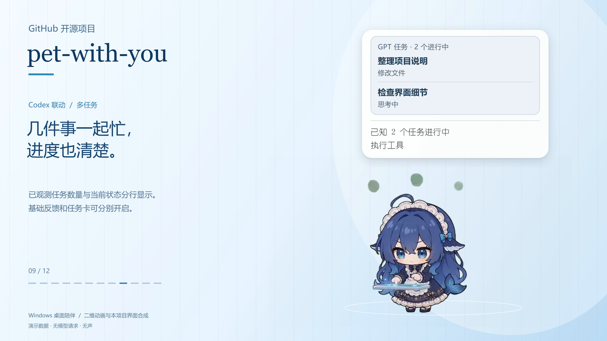
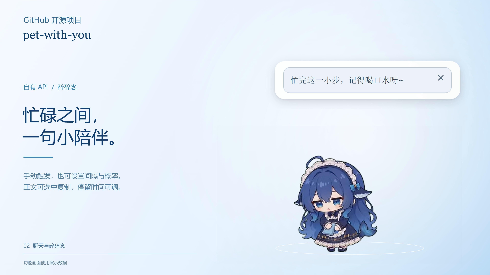
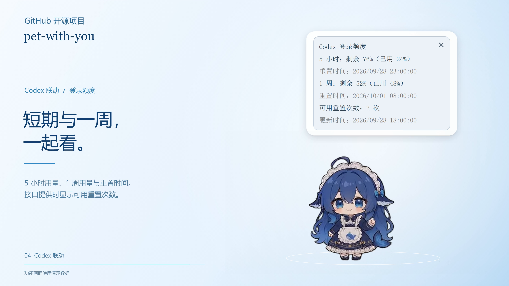

# pet-with-you

**让一只小伙伴，陪你工作，也陪你发呆。**

一个运行在 Windows 桌面上的动画桌宠：可以随机玩耍、手动点播、聊天与碎碎念，也可以连接 Codex 桌面客户端，展示任务进度和账户额度。

> `0.1.0-alpha.3` 本地预览版，支持 Windows x64 安装程序与源码启动。由 [Refining-colors](https://github.com/Refining-colors) 维护，仓库为 [pet-with-you](https://github.com/Refining-colors/pet-with-you)。尚未公开发布；项目代码采用 MIT，角色动画与字体按各自条款说明。

基于 [PC2005-cloud/dsh-pet](https://github.com/PC2005-cloud/dsh-pet) 改造与扩展，保留原作角色和 106 段动画。原作代码、素材与本项目适配工作的关系见 [来源与致谢](ATTRIBUTION.md)。

[快速开始](#快速开始) · [功能介绍](#功能介绍) · [模式与连接](#模式与连接) · [常见问题](#常见问题) · [全流程配置](docs/INSTALL.md) · [使用手册](docs/USER_GUIDE.md) · [排错](docs/TROUBLESHOOTING.md) · [录屏与动画导出](docs/MEDIA_GUIDE.md)

## 看看它能做什么



| 聊天与碎碎念 | 登录账户额度 |
| --- | --- |
|  |  |

配图由本项目自动录制工具生成，使用本项目当前界面，任务标题、回复、额度和日期均为演示数据。角色动画来自 [dsh-pet](https://github.com/PC2005-cloud/dsh-pet)。可运行 `Record-Demo.cmd` 生成自己的演示视频，详见 [媒体制作手册](docs/MEDIA_GUIDE.md)。

## 功能介绍

### 陪伴与互动

- **106 段动画**：待机、点击回应、吃东西、玩耍等；日常动作按分类权重随机轮换，也可右键手动点播。
- **桌面互动**：拖动、抛掷、尺寸调整、多宠物同屏，支持禁止自主跑动。
- **窗口与位置**：置顶、全屏隐藏、GPT 客户端例外；支持靠近屏幕底部、任务栏上方及客户端窗口下沿时吸附。
- **位置记忆**：切换模式、重新打开时尽量恢复原位置；显示器变化时将宠物调整到可见区域。
- **托盘管理**：隐藏托盘图标后，可以从桌宠右键菜单恢复。

### 聊天与碎碎念

- 使用自己的 OpenAI 兼容 API，填写地址、模型和密钥即可配置聊天服务。
- 支持手动碎碎念、自动碎碎念，以及间隔和触发概率设置。
- 碎碎念支持流式显示，本次运行内记录历史并拦截完全重复的句子。
- 回复可选中文字复制，右上角关闭；停留方式支持定时、下一次信息前保留、永久保留。
- 支持系统字体和导入字体；查询字体与基础反馈／聊天字体分别设置。
- 当前 API 配置与命名配置列表分开管理，支持保存、载入、删除和清除。

### Codex 任务联动

- 展示思考、执行工具、整理结果、等待确认、出错和回合完成等已观测到的状态。
- 基础动画反馈与原生风格任务卡可分别开关；同时启用时任务卡显示在上方。
- 多任务按优先级展示，最多列出三个任务，更多任务显示数量；已识别的对话标题可点击打开。
- 提供“关闭事件响应”开关，演示或录屏时暂停任务动画、任务气泡、任务通知和回合结束自动额度查询。
- 首次连接询问是否创建 **Codex withu** 联动启动器，可自选目录，双击同时打开客户端与桌宠；无需常驻启动检测。随客户端关闭和开机自启动仍分别设置。

### 额度与设置

- Codex 登录额度展示 **5 小时和 1 周的已用／剩余比例、各自重置时间、可用重置次数和更新时间**。
- 支持 CRS 统计查询和部分服务商的通用 JSON 余额接口。
- 支持回合结束后自动查询，默认关闭；有其他任务时暂缓显示最新查询结果。启动、闲置和设置重建不会自行查询弹出额度。
- 设置分为“基础设置”和“GPT连接设置”，同一选项卡内的模块可以拖动排序。
- 普通设置修改后，关闭设置窗口自动保存；失败时保留窗口和未保存的内容。
- 所有普通设置集中于 `settings.json`，设置底部可定位并分享；实际密钥单独在本机加密保存。
- 基础设置底部可选择目录创建名为 `pet-with-u`、带角色图标的启动快捷方式，同名文件自动另加编号。此名称已更新于源码，现存 alpha.3 安装包待下次统一更新。
- 首次正常打开设置时会询问是否创建快捷方式，可选择保存目录或跳过；选择会被记住，后台联动启动不弹出此提示。此功能待下次打包。
- 提供错误日志、导出反馈、打开日志目录及清除日志功能。

## 快速开始

### 运行环境

- Windows 10 / 11。
- 安装程序自带运行环境，纯桌宠无需额外安装 Node.js。
- 源码启动需要 Node.js 22.12 或更高版本，首次安装需要下载 Electron 依赖。

本地预览安装程序会询问安装目录和是否创建桌面快捷方式，尚无公开下载。构建与验证见 [预览版打包说明](docs/PACKAGING.md)。纯桌宠可以独立运行，不需要 Codex、Git 或密钥。初次接触 GitHub 请从 [零基础配置手册](docs/INSTALL.md) 开始。

### 从源码安装和启动

1. 将项目源码解压到一个准备长期保留的目录。
2. 双击 `Install-Pet.cmd` 安装依赖，等待提示完成。可双击 `Check-Setup.cmd` 检查环境。
3. 双击 `Start-Pet.cmd` 启动桌宠和设置。
4. 首次默认使用纯桌宠模式；右键宠物可查看动作和打开设置。

也可在项目目录使用终端：

```powershell
npm ci
node launch.cjs
```

### 三个启动入口

| 文件 | 作用 |
| --- | --- |
| `Start-Pet.cmd` | 启动桌宠及设置，使用上次保存的模式 |
| `Connect-Pet.cmd` | 打开连接设置，适合先配置客户端联动 |
| `Start-And-Connect.cmd` | 启动桌宠并准备客户端联动配置 |

`Install-Pet.cmd` 会询问是否创建桌面快捷方式，也可单独运行 `Create-Shortcut.cmd`；快捷方式使用与托盘相同的角色图标。移动源码目录后请重新创建。更详细的说明见 [安装与启动](docs/INSTALL.md)。

## 模式与连接

| 能力 | 纯桌宠 | 连接 Codex 桌面客户端 |
| --- | --- | --- |
| 日常动画、随机播放、手动点播 | 支持 | 支持 |
| 自有 API 聊天与碎碎念 | 支持 | 支持，可选择服务来源 |
| 服务商密钥／代理额度查询 | 配置接口后支持 | 配置接口后支持 |
| 客户端任务状态反馈 | 关闭 | 根据本机可用事件显示 |
| Codex 登录账户额度 | 关闭 | 账户和接口可用时支持 |
| 联动启动器／随客户端关闭 | 已创建的启动器可同时打开两个应用，保留纯桌宠模式；不随客户端退出 | 可创建启动器，随关闭单独设置 |

### 使用自己的 API

在“基础设置 → 聊天与碎碎念”填写 API 地址、模型和密钥。支持 OpenAI 兼容 Chat Completions；地址可以是服务商的 `v1` 根地址或完整的 `chat/completions` 地址。模型名需要由服务商支持。

关闭设置即可应用当前配置。“保存到配置列表”用于留存可重复载入的命名配置；清除当前配置不会删除列表中的副本。

### 连接 Codex

开启“连接 GPT 客户端”后，会出现“GPT连接设置”选项卡。首次连接可选择桌宠聊天使用当前账户／config 配置，或使用自有 API。

桌宠优先查找桌面客户端附带的兼容 `codex.exe`。若安装渠道没有提供，需要自行选择已有兼容运行程序，或安装 Codex CLI。纯桌宠及自有 API 聊天无需此运行程序。

任务反馈通过本机任务记录与 Hooks 配合获取；Hooks 首次使用可能需要在 `/hooks` 中审阅并信任。设置中显示真实事件，才能确认已观测到客户端任务。

目前任务联动针对 **Codex 桌面客户端**。界面中的“GPT连接设置”是功能分组名称，兼容性以实际支持的客户端与事件为准。本地任务记录格式可能随客户端版本改变，远程或云端任务也可能无法完整显示。

## 用量与数据

| 操作 | 是否调用聊天模型 |
| --- | --- |
| 播放动画、拖动、设置、任务状态反馈 | 否 |
| 查询额度或服务商统计 | 否，查询对应额度接口 |
| 手动聊天、手动碎碎念 | 是 |
| 自动碎碎念命中概率并实际生成 | 是 |

- 配置和运行数据位于当前 Windows 用户的 `%APPDATA%\DSH Pet Companion`。这是保留的兼容目录名，升级改名不会丢失设置，具体用户名/磁盘路径不写死。
- 自有 API 密钥和手动查询密钥通过系统加密保存；界面显示掩码。
- 聊天内容会发送给你选择的服务，聊天记忆可保存在本机；碎碎念历史只保留在本次桌宠运行内。
- 当前项目的错误日志不记录密钥、聊天正文或服务商完整响应。
- 对外分享项目时，只分享整理后的源码和授权素材；个人配置、登录文件、密钥及私人字体属于本机数据。

## 常见问题

<details>
<summary>为什么打开了连接开关，任务卡还没有变化？</summary>

开关用于启用连接功能，任务卡需要真实的任务事件。检查设置中的连接状态、任务联动勾选和“关闭事件响应”开关；继续或新开一个任务以观察事件。Hooks 是否受信任与本地会话读取状态可分别检查。

</details>

<details>
<summary>多个任务一起运行，桌宠会显示哪一个？</summary>

基础动画一次表达一种状态。优先级从高到低为：等待确认、工具出错、执行工具、思考、整理结果、回合完成；同级优先显示最近更新的任务。任务卡同时列出最多三个任务。数量只涵盖已观测到的任务。

</details>

<details>
<summary>聊天能用，为什么余额查不到？</summary>

聊天 API 与余额接口是不同的服务。余额查询需要服务商提供的查询接口及正确的凭据来源。当前支持 CRS 和部分 HTTPS JSON 查询接口；并非所有服务商都提供余额查询。

</details>

<details>
<summary>周额度或可用重置次数显示“未提供”是什么意思？</summary>

表示本次接口没有返回该项，不能按零用量或零次数理解。更新时间为最近成功取得数据的本机时间，缓存期间保持不变。

</details>

<details>
<summary>每次修改都要点击保存吗？</summary>

普通设置在关闭设置窗口时自动保存。保存到命名配置列表、载入、删除和清除是独立操作，仍使用对应按钮。输入无效或保存失败时窗口会保留并显示提示。

</details>

<details>
<summary>移动了项目目录，开机启动或联动失效了怎么办？</summary>

在新目录手动启动一次，更新启动入口，并重新连接以刷新 Hooks 路径；必要时重新信任 Hooks。删除项目前先关闭相关自启动开关。用户数据与源码目录分开保存。

</details>

## 反馈与开发

遇到问题时，请记录复现步骤、Windows 版本、运行模式及相关设置；错误日志可在设置中导出。截图或日志公开前，检查是否含个人内容。

开发者在项目目录运行（`npm start` 使用独立开发配置）：

```powershell
npm start
npm test
npm run test:ui
npm run check:docs
```

测试中的聊天和额度接口使用模拟数据，不发起付费模型请求，界面验证使用临时个人数据目录。另提供 [贡献说明](CONTRIBUTING.md)、[架构说明](docs/ARCHITECTURE.md)、[安全说明](SECURITY.md)、[更新记录](CHANGELOG.md) 和 [发布准备清单](docs/RELEASE_PREPARATION.md)。

开发预览与日常启动的区别、初始设置和 Git 操作见 [源码工作区指南](docs/WORKSPACE.md)。开发预览中自行配置 API 后的请求是真实请求；只有自动测试使用模拟服务。

需求演进、重要取舍和后续 AI 接手说明见 [项目开发历程](docs/PROJECT_HISTORY.md)。版本改动摘要另见 [更新记录](CHANGELOG.md)。

## 原作、维护与许可

本项目基于 [PC2005-cloud/dsh-pet](https://github.com/PC2005-cloud/dsh-pet) 开发。感谢原作者 **PC2005-cloud** 提供角色动画及桌宠基础；本项目在此基础上实现独立 Windows 使用方式与 Codex 联动等扩展。

- **本项目维护者：** [Refining-colors](https://github.com/Refining-colors)。
- **上游代码：** MIT，保留 [原许可证](LICENSE.upstream)。
- **上游素材：** 动画、提示词、源视频允许开源使用，禁止商用；衍生作品须按上游约定附原仓库地址。
- **本项目新增代码：** 使用 [MIT 许可证](LICENSE)，保留 [上游 MIT 声明](LICENSE.upstream)。

完整关系与署名要求见 [ATTRIBUTION.md](ATTRIBUTION.md)。
